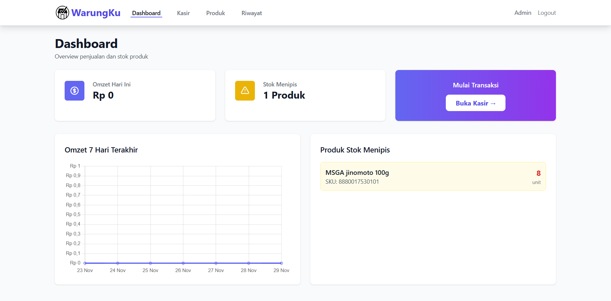
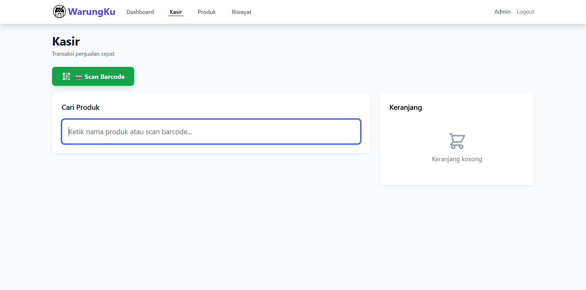
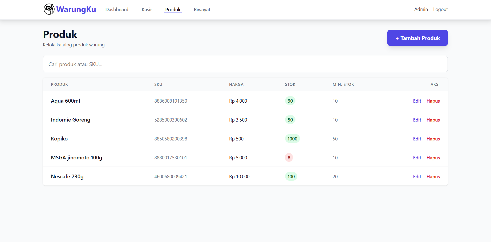
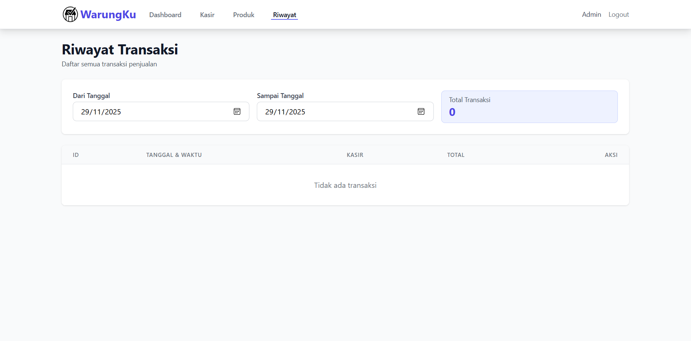

# WarungKU

<div align="center">
  <!-- logo -->
  
  
  <p align="center">
    <strong>Sistem Manajemen Warung Modern</strong>
  </p>
  
  <p align="center">
    Aplikasi point of sale (POS) untuk memudahkan pengelolaan warung/toko dengan fitur-fitur lengkap dan user-friendly
  </p>

  <!-- Badges - sesuaikan dengan project Anda -->
  <p align="center">
    
    
  </p>
</div>

---

## 📋 Daftar Isi

-   [Tentang Project](#-tentang-project)
-   [Fitur Utama](#-fitur-utama)
-   [Screenshot](#-screenshot)
-   [Teknologi yang Digunakan](#-teknologi-yang-digunakan)
-   [Prasyarat](#-prasyarat)
-   [Instalasi](#-instalasi)
-   [Penggunaan](#-penggunaan)
-   [Konfigurasi](#-konfigurasi)
-   [Struktur Database](#-struktur-database)
-   [API Documentation](#-api-documentation)
-   [Roadmap](#-roadmap)
-   [Kontribusi](#-kontribusi)
-   [License](#-license)
-   [Kontak](#-kontak)
-   [Acknowledgments](#-acknowledgments)

---

## 🎯 Tentang Project

**WarungKU** adalah aplikasi point of sale (POS) berbasis web yang dirancang khusus untuk membantu pemilik warung atau toko kecil dalam mengelola bisnis mereka dengan lebih efisien. Aplikasi ini menyediakan antarmuka yang sederhana namun powerful untuk melakukan transaksi penjualan, manajemen stok, dan pelaporan keuangan.

### Latar Belakang

Banyak warung tradisional masih menggunakan metode pencatatan manual yang rentan terhadap kesalahan dan sulit untuk dianalisis. WarungKU hadir sebagai solusi digitalisasi yang terjangkau dan mudah digunakan, bahkan untuk pengguna yang tidak familiar dengan teknologi.

### Tujuan Project

-   Memudahkan proses transaksi penjualan
-   Mengelola inventori/stok barang secara real-time
-   Menyediakan laporan penjualan dan keuangan yang akurat
-   Meningkatkan efisiensi operasional warung/toko kecil

---

## ✨ Fitur Utama

-   🛒 **Manajemen Produk**

    -   Tambah, edit, dan hapus produk
    -   Kategori produk
    -   Barcode scanning

-   💰 **Point of Sale (POS)**

    -   Interface kasir yang intuitif
    -   Perhitungan otomatis
    -   Cetak struk transaksi

-   📦 **Manajemen Stok**

    -   Tracking stok real-time
    -   Notifikasi stok minimum
    -   Riwayat pergerakan stok
    -   Restock management

-   📊 **Laporan & Analitik**

    -   Laporan penjualan
    -   Grafik penjualan
    -   Produk terlaris
    -   Laporan laba/rugi

-   🔐 **Keamanan**
    -   Autentikasi dan otorisasi
    -   Enkripsi data sensitif
    -   Session management

---

## 📸 Screenshot

<div align="center">
  
### Dashboard


### Kasir (Transaksi)



### Manajemen Produk



### Laporan Penjualan



</div>

---

## 🛠️ Teknologi yang Digunakan

### Backend

-   **PHP**  - Bahasa pemrograman utama
-   **Laravel**  - PHP Framework
-   **MySQL**  - Database management system

### Frontend

-   **HTML5** - Markup language
-   **CSS3** / **Bootstrap 5** - Styling framework
-   **JavaScript** - Programming language
-   **jQuery** - JavaScript library
-   **Chart.js** - Data visualization

### Tools & Libraries

-   **Composer** - PHP dependency manager
-   **NPM** - Node package manager
-   **Git** - Version control
-   **Laragon** - Local development environment

---

## 📋 Prasyarat

Sebelum memulai instalasi, pastikan sistem Anda memiliki:

-   PHP >= 8.0
-   Composer >= 2.0
-   MySQL >= 8.0 atau MariaDB >= 10.3
-   Apache/Nginx web server
-   Node.js >= 16.x dan NPM (opsional, untuk development)
-   Git (untuk cloning repository)

---

## 🚀 Instalasi

### 1. Clone Repository

```bash
git clone https://github.com/Asenn4/WarungKU.git
cd WarungKU
```

### 2. Install Dependencies

```bash
# Install PHP dependencies
composer install

# Install Node.js dependencies (jika ada)
npm install
```

### 3. Konfigurasi Environment

```bash
# Copy file .env.example menjadi .env
cp .env.example .env

# Generate application key
php artisan key:generate
```

### 4. Konfigurasi Database

Edit file `.env` dan sesuaikan dengan konfigurasi database Anda:

```env
DB_CONNECTION=mysql
DB_HOST=127.0.0.1
DB_PORT=3306
DB_DATABASE=warungku_db
DB_USERNAME=root
DB_PASSWORD=
```

### 5. Buat Database

```bash
# Buat database baru
mysql -u root -p
CREATE DATABASE warungku_db;
exit;
```

### 6. Migrasi Database

```bash
# Jalankan migration
php artisan migrate

# Jalankan seeder (data dummy untuk testing)
php artisan db:seed
```

### 7. Jalankan Aplikasi

```bash
# Development server
php artisan serve

# Aplikasi akan berjalan di http://localhost:8000
```

---

## 💻 Penggunaan

### Login Kredensial Default

Setelah menjalankan seeder, Anda dapat login dengan:

-   Email: admin@warung.com
-   Password: password

> ⚠️ **Penting:** Segera ubah password default setelah login pertama kali!

### Workflow Dasar

1. **Login** ke sistem dengan kredensial yang sesuai
2. **Tambahkan Produk** melalui menu Manajemen Produk
3. **Lakukan Transaksi** melalui menu POS
4. **Lihat Laporan** di menu Dashboard atau Laporan

---

## ⚙️ Konfigurasi

### Konfigurasi Aplikasi

File konfigurasi utama terdapat di `config/app.php`. Anda dapat mengatur:

-   Timezone aplikasi
-   Locale (bahasa)
-   URL aplikasi
-   Dan lainnya

### Konfigurasi POS

Edit file `config/pos.php` untuk mengatur:

```php
return [
    'tax_rate' => 10, // Pajak dalam persen
    'currency' => 'Rp', // Simbol mata uang
    'receipt_header' => 'WarungKU', // Header struk
    'receipt_footer' => 'Terima kasih atas kunjungan Anda', // Footer struk
];
```

### Konfigurasi Email (Opsional)

Jika ingin mengaktifkan notifikasi email, edit `.env`:

```env
MAIL_MAILER=smtp
MAIL_HOST=smtp.gmail.com
MAIL_PORT=587
MAIL_USERNAME=your_email@gmail.com
MAIL_PASSWORD=your_password
MAIL_ENCRYPTION=tls
MAIL_FROM_ADDRESS=your_email@gmail.com
MAIL_FROM_NAME="${APP_NAME}"
```

---

## 🗄️ Struktur Database

### Tabel Utama

```
users
├── id
├── name
├── email
├── password
├── role (admin/kasir)
└── timestamps

products
├── id
├── name
├── description
├── category_id
├── price
├── stock
├── image
└── timestamps

categories
├── id
├── name
└── timestamps

transactions
├── id
├── user_id
├── total_amount
├── payment_method
├── status
└── timestamps

transaction_details
├── id
├── transaction_id
├── product_id
├── quantity
├── price
└── subtotal
```

### Entity Relationship Diagram (ERD)

```
users 1──────* transactions
             │
             │
             └──────* transaction_details
                             │
                             │
                             └──────* products ──────* categories
```

---

## 📖 API Documentation

### Base URL

```
http://localhost:8000/api
```

### Authentication

Semua endpoint API memerlukan Bearer token kecuali endpoint login.

### Endpoints

#### Authentication

```http
POST /api/login
POST /api/logout
```

#### Products

```http
GET    /api/products          # Get all products
GET    /api/products/{id}     # Get product by ID
POST   /api/products          # Create new product
PUT    /api/products/{id}     # Update product
DELETE /api/products/{id}     # Delete product
```

#### Transactions

```http
GET    /api/transactions      # Get all transactions
POST   /api/transactions      # Create new transaction
GET    /api/transactions/{id} # Get transaction by ID
```

### Example Request

```javascript
// Login
fetch("http://localhost:8000/api/login", {
    method: "POST",
    headers: {
        "Content-Type": "application/json",
    },
    body: JSON.stringify({
        email: "admin@warungku.com",
        password: "admin123",
    }),
});
```

---

## 🗺️ Roadmap

-   [x] Basic POS functionality
-   [x] Product management
-   [x] Transaction management
-   [x] Basic reporting
-   [ ] Mobile responsive design
-   [ ] Multi-store support
-   [ ] Integration dengan e-commerce
-   [ ] Customer loyalty program
-   [ ] Inventory forecasting dengan AI
-   [ ] Mobile app (Android & iOS)

---

## 🤝 Kontribusi

Kontribusi sangat diterima! Berikut cara untuk berkontribusi:

1. Fork repository ini
2. Buat branch baru (`git checkout -b feature/AmazingFeature`)
3. Commit perubahan Anda (`git commit -m 'Add some AmazingFeature'`)
4. Push ke branch (`git push origin feature/AmazingFeature`)
5. Buat Pull Request

### Guidelines Kontribusi

-   Pastikan code Anda mengikuti coding standards (PSR-12 untuk PHP)
-   Tulis unit test untuk fitur baru
-   Update dokumentasi jika diperlukan
-   Jelaskan perubahan Anda dengan detail di Pull Request

---

## 📞 Kontak

**Developer:**

[Riziq Izza Lathif Hilman]

-   Email: 111202416012@mhs.dinus.ac.id

[Mohammad Wisam Wiraghina]

-   Email: 111202415739@mhs.dinus.ac.id

[Muhammad Abid]

-   Email: 111202415597@mhs.dinus.ac.id

[Aulia Rahman Afryansyah]

-   Email: 111202415810@mhs.dinus.ac.id

**Project Link:** [https://github.com/Asenn4/WarungKU](https://github.com/Asenn4/WarungKU)

---

## 🙏 Acknowledgments

-   [Laravel Documentation](https://laravel.com/docs)
-   [Bootstrap](https://getbootstrap.com/)
-   [Chart.js](https://www.chartjs.org/)
-   [Font Awesome](https://fontawesome.com/)
-   Inspirasi dari berbagai project open source POS system
-   Komunitas developer Indonesia

---

<div align="center">
  <p>Dibuat dengan ❤️ oleh <a href="https://github.com/Asenn4">Asenn4</a></p>
  <p>⭐ Star project ini jika bermanfaat!</p>
</div>
